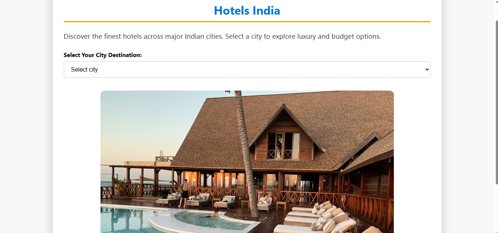

# 🏨 Hotels India - Vacation Planner

A responsive web application to explore and book hotels across major Indian cities. Discover luxury and budget hotels, view detailed hotel information, and book your stay—all in one place. Built with **HTML**, **CSS**, and **JavaScript**, featuring real hotel images for an immersive experience.

---

## 🌆 Features

- Select a city (Bangalore, Pune, Hyderabad) to explore hotels.
- Browse **Luxury** and **Budget** hotels with real images.
- View detailed hotel information
  - Room types and pricing
  - Contact details (email, phone, website)
  - Address
- Interactive **booking form** to simulate hotel reservations.
- Fully **responsive design** for mobile and desktop devices.

---

## 📂 Project Structure

hotels-booking/
│
├─ index.html
├─ styles.css
├─ script.js 
├─ README.md

---

## 🎨 Technologies Used

- **HTML5** – Structure of the web pages
- **CSS3** – Styling and responsive layout
- **JavaScript** – Dynamic hotel listings and booking form
- **Unsplash Images** – Realistic hotel images

---
## 🧭 How It Works

User selects a city (Bangalore, Pune, or Hyderabad)

Available Luxury & Budget hotels are displayed dynamically

Clicking a hotel shows:

Pricing & room details

Contact information

Address

User fills the booking form to simulate a hotel reservation

✨ Highlights

🌍 City-based hotel filtering

🏨 Realistic hotel images for better UX

📱 Fully responsive layout

📝 Interactive booking form

⚡ Fast & lightweight (no backend required)

🧪 Sample Use Case

A user planning a vacation can compare hotels across cities, check pricing and contact details, and simulate booking—all from a single interface.

##  Screenshots

### Home Screen

🌱 Future Enhancements

🔐 User login & authentication

🗓 Date-based booking availability

💳 Payment gateway integration

🗺 Google Maps integration for hotel locations

🧾 Booking confirmation page

🏷 Price filters & ratings

## 📌 Learning Outcomes

DOM manipulation using JavaScript

Responsive design using CSS Flexbox/Grid

Handling user interactions and form data

Structuring a frontend web project

Using real-world images for better UI design

## 💡 Author

**JAYANTH D R**

